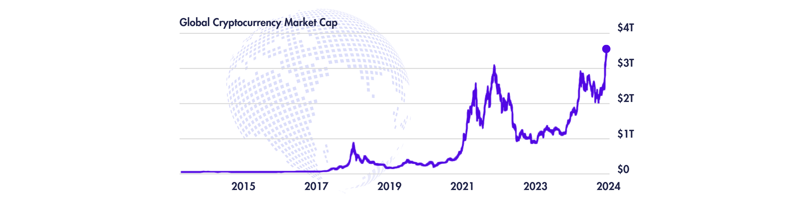

  <!-- Adds extra vertical space -->

### Current Global Cryptocurrency Market Cap

As of November 24, 2024, the global cryptocurrency market cap (market capitalization) is $3.34T in USD. It rises by the day in numbers that cannot be estimated. It can be monitored in real time on CoinMarketCap.com. All of the statistics that will continue to be reported in this section are also as of November 24, 2024.

  <!-- Adds extra vertical space -->
### Bitcoin vs. Other Cryptocurrencies

Many have seen the news headlines of Bitcoin being at an all-time high after the 2024 U.S. Presidential Election and wonder why that is so. First off, it’s good to clarify that Bitcoin is just one of the tens of thousands of cryptocurrencies available worldwide. The main reason why we see “Bitcoin” in the headlines is because it is the most familiar one since it was the very first cryptocurrency that was created in 2009. Aside from that, Bitcoin currently has the largest market share in the cryptocurrency market at over 50% and its value nearing $100,000.

  <!-- Adds extra vertical space -->
### Trump’s Disapproval of Current Crypto Regulators

With that being said, we can dive into why cryptocurrency is on the rise after the election. U.S. President-elect Donald Trump has stated that once he takes office, he plans to remove the U.S.’s Security and Exchange Commission (government agency that oversees financial markets) Chairman Gary Gensler from his position. The problem, however, is that a President doesn’t actually have the authority to directly fire him, but can only appoint a new Chairman while Gensler would remain a commissioner in the agency. Gensler, however, ahead of time has announced this month that he will be stepping down from the SEC.

  <!-- Adds extra vertical space -->
### Crypto Industry’s Distrust in the Current Crypto Regulators

Lorem ipsum odor amet, consectetuer adipiscing elit. Bibendum montes nostra volutpat augue senectus massa ultricies nam. Ac sem nec dolor nostra ad tincidunt velit id. Integer sagittis pretium mauris morbi massa congue volutpat. Lobortis lacinia eget, lorem hac maximus nec aliquet. Bibendum nisi consequat ullamcorper vivamus dictumst. Justo blandit vivamus sociosqu eros integer facilisis libero mollis. Ex turpis aliquam tellus parturient massa facilisis.
  <!-- Adds extra vertical space -->
### Trump’s Plans for the Future of Crypto 

Lorem ipsum odor amet, consectetuer adipiscing elit. Bibendum montes nostra volutpat augue senectus massa ultricies nam. Ac sem nec dolor nostra ad tincidunt velit id. Integer sagittis pretium mauris morbi massa congue volutpat. Lobortis lacinia eget, lorem hac maximus nec aliquet. Bibendum nisi consequat ullamcorper vivamus dictumst. Justo blandit vivamus sociosqu eros integer facilisis libero mollis. Ex turpis aliquam tellus parturient massa facilisis.
  <!-- Adds extra vertical space -->
